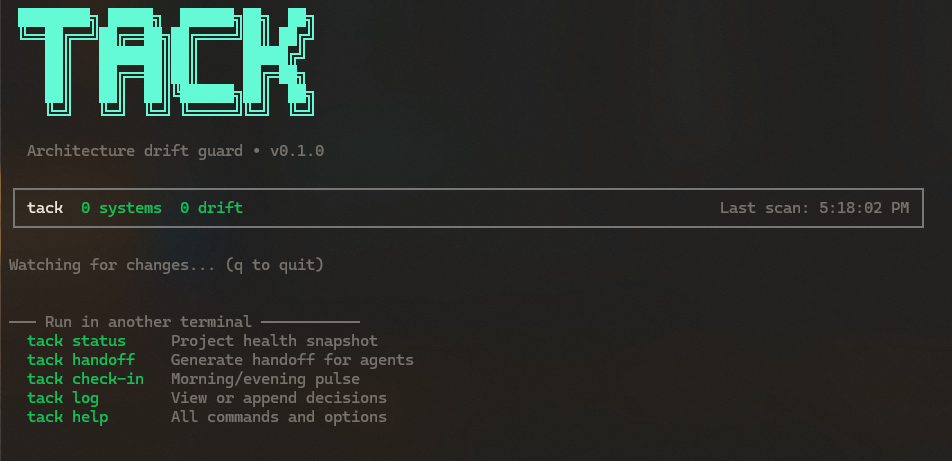

# tack

Architecture drift guard. Declare your spec. Tack enforces it.

## Why Tack

`tack` is a context and change-tracking layer for agent-driven software work.

It gives agents and humans a shared project memory across sessions:

- Captures architecture intent in `spec.yaml` and supporting context docs.
- Detects architecture signals in code and tracks drift over time.
- Generates handoff artifacts (`.md` + canonical `.json`) for the next agent/session.
- Preserves machine history in append-only logs.
- Supports explicit decision and note write-back for continuity.

## Persistent Context in `.tack/`

All state lives in `./.tack/` so work survives restarts, agent changes, and handoffs:

- `context.md`, `goals.md`, `assumptions.md`, `open_questions.md` - human intent and constraints.
- `decisions.md` - durable decision history with reasoning.
- `_notes.ndjson` - timestamped agent notes between sessions.
- `spec.yaml` - declared architecture contract (allowed/forbidden systems, constraints, optional `domains` map).
- `_audit.yaml` - latest detector snapshot.
- `_drift.yaml` - unresolved/accepted/rejected drift items.
- `_logs.ndjson` - append-only machine event stream.
- `handoffs/*.md` and `handoffs/*.json` - transfer artifacts for the next session.
- `verification.md` - validation steps carried into handoffs.

Agents and tools consume this state via:

- The `tack-mcp` server (Model Context Protocol), which exposes context resources and write-back tools.
- Direct file access to `.tack/`, where human-authored docs and machine-managed state live together.

## Change Tracking Workflow

- `tack status` updates `_audit.yaml` and computes drift against your spec.
- `tack watch` continuously rescans and appends events to `_logs.ndjson`.
- `tack handoff` packages context + machine state + git deltas for the next session.
- `tack log` and `tack note` store decisions and notes that future agents can reuse.

## Install

```bash
npm install
npm run build
```

Optional global/local CLI use:

```bash
npm link
# now `tack` is available globally on this machine
```

Or package for use in another project:

```bash
npm pack
# then install the tarball in another project if desired
```

## Usage

From any project directory:

```bash
node /absolute/path/to/tack/dist/index.js init
node /absolute/path/to/tack/dist/index.js status
node /absolute/path/to/tack/dist/index.js watch
node /absolute/path/to/tack/dist/index.js handoff
node /absolute/path/to/tack/dist/index.js log
node /absolute/path/to/tack/dist/index.js note
```

Within the `tack` repo itself:

```bash
node dist/index.js help
```

## `tack watch` Preview



## Typical Multi-Session Loop

```bash
# Session start
tack status

# During work
tack watch

# Record key intent changes
tack log
tack note

# Session end
tack handoff
```

## Using Tack with Agents

Tack treats LLM agents as **clients of a deterministic engine**. Agents should read context from `.tack/` and write back through the documented channels instead of mutating machine-managed files directly.

### MCP (Model Context Protocol)

CLI build/run is Node-native (`npm run build` + `node dist/index.js ...`).  
MCP currently runs from TypeScript source with Bun:

```bash
bun run src/mcp.ts
```

The server (`tack-mcp`) exposes these key resources:

- `tack://context/intent` – `context.md`, `goals.md`, `open_questions.md`, `decisions.md`
- `tack://context/facts` – `implementation_status.md` and `spec.yaml`
- `tack://context/machine_state` – `_audit.yaml` and `_drift.yaml`
- `tack://context/decisions_recent` – recent decisions as markdown
- `tack://handoff/latest` – latest handoff JSON (`.tack/handoffs/*.json`)

And these tools for write-back:

- `log_decision` – append a decision to `.tack/decisions.md` and log a `decision` event
- `log_agent_note` – append an agent note to `.tack/_notes.ndjson`

### Direct File Access

Agents without MCP should:

- **Read**:
  - `.tack/spec.yaml` — architecture guardrails
  - `.tack/context.md`, `.tack/goals.md`, `.tack/assumptions.md`, `.tack/open_questions.md`
  - `.tack/implementation_status.md`
  - `.tack/_audit.yaml`, `.tack/_drift.yaml`
  - `.tack/verification.md` — validation/verification steps to run after changes
  - `.tack/handoffs/*.json`, `.tack/handoffs/*.md`
  - `.tack/_notes.ndjson` — agent working notes (NDJSON)
- **Write back**:
  - Append decisions to `.tack/decisions.md`: `- [YYYY-MM-DD] Decision — reason`
  - Use the CLI to log notes: `tack note --message "..." --type discovered --actor agent:cursor`
  - Or append NDJSON lines manually to `.tack/_notes.ndjson` if the CLI is not available

Do **not** modify `.tack/_drift.yaml`, `.tack/_audit.yaml`, or `.tack/_logs.ndjson` directly; they are machine-managed.

## Detectors and YAML rules

Detection is **YAML-driven**. Bundled rules live in `src/detectors/rules/*.yaml` and are shipped with the CLI. At runtime we also load any `*.yaml` from `.tack/detectors/` (optional project extension).

Each rule file uses this schema:

- **Top-level:** `name`, `displayName`, `signalId`, `category` (`system` | `scope` | `risk`).
- **`systems`:** list of entries, each with:
  - `id` — system identifier (e.g. `nextjs`, `prisma`, `stripe`)
  - `packages` — npm package names that imply this system
  - `configFiles` — paths to look for (e.g. `next.config.js`)
  - `directories` — optional dirs (e.g. `src/jobs`)
  - `routePatterns` — optional regex strings to grep in project files

If any of packages/configFiles/directories/routePatterns match for a system, one signal is emitted (confidence 1). Invalid YAML or bad regex is skipped without failing the scan. The only detectors still implemented in TypeScript are `multiuser`, `admin`, and `duplicates`; all other primary systems (framework, auth, db, payments, background_jobs, exports) are defined in YAML.

## Commands

### `init`

- Runs a detector sweep
- Prompts you to classify detected systems as allowed/forbidden/skip
- Writes initial files under `./.tack/`

### `status`

- Runs a one-shot scan
- Updates `./.tack/_audit.yaml`
- Computes drift and prints summary

### `watch`

- Starts persistent file watching
- Re-scans on file changes
- Creates drift items for new violations/risks/undeclared systems
- Sends OS notifications for violations and risks
- Press `q` to quit

### `handoff`

- Reads context docs + current machine state
- Reads file-level git changes
- Writes `./.tack/handoffs/<timestamp>.md`
- Writes `./.tack/handoffs/<timestamp>.json` (canonical)
- Includes a **Validation / Verification** section driven by `.tack/verification.md`:
  - Each bullet/numbered item becomes a `verification.steps` entry in JSON and a markdown bullet
  - Intended for humans or external tools to know which commands/checks to run after applying the handoff
  - Tack does **not** execute these commands automatically

## Keyboard Controls

In selection prompts (`init`, drift options):

- `↑` / `↓` to move
- `Enter` to confirm

## Development

```bash
npm run typecheck
bun test
npm run build
```

Optional Bun fast path for build contributors:

```bash
npm run build:bun
```

Node-only watch fallback (build then run plain watcher):

```bash
npm run dev:node
```

## Notes

- Offline-only (no network calls)
- Writes are guarded to `./.tack/` only
- Python virtual environments are ignored during scans (`venv`, `.venv`, `site-packages`) to avoid false positives

